# hoglake webui

Management console for the hoglake control plane: catalogs, namespaces,
tables (schema / files / scan / partitions, with time travel), the snapshot timeline
(newest-first, paged down from head via the `before` cursor), consumer
offsets, a per-catalog compaction-debt view, maintenance views (a
central catalog × task matrix + per-catalog task pages), and a server
metrics page.
Read-heavy by design — v1 exposes create forms for catalogs,
namespaces, and tables, and deliberately no drop/delete actions.

A namespace's table listing is NAME, RECORD_COUNT, FILE_COUNT,
FILE_SIZE, SNAPSHOTS, EARLIEST_SNAPSHOT, COMMENT — one `TableSummary`
row per table, every field resolved at the catalog head (the listing
takes no snapshot parameter). SNAPSHOTS and EARLIEST_SNAPSHOT are
RETAINED-only and shrink as expiry advances the catalog floor.
RECORD_COUNT is gross of deletion vectors — a row a live DV masks is
still counted, as the table page's own count is — and its header
tooltip says so. The comment is clamped to its first line with an
expand control, like a snapshot message. `table_uuid` is still on the
wire — consumers key on it — but it is shown on the table page with
its copy button rather than as a column, because seven columns of
which one is a UUID reads as a UUID table. The listing is not paged;
see the endpoint's OpenAPI description for the measured cost on a
54k-table namespace.

Notable surfaces beyond the catalog browser:

- **Metrics** (`/metrics` route): one snapshot of the server's
  Prometheus endpoint rendered visually — stat tiles, per-label bars,
  histogram bucket strips. Manual refresh only, no polling.
- **Partitions** (the table page's `partitions` tab): one row per
  partition of one table — files, small files, actionable debt, total
  and average size, deletion vectors, rows, and the snapshot that last
  wrote to it — with a filter box per partition key (matching the
  DECODED value by prefix, so `2026-09` finds every day of that month)
  and a link from each row into the files tab filtered to it. Each key
  also carries an explicit "is null" toggle, because the null partition
  value has no text to prefix-match and an empty box means unfiltered.
  THE NUMBERS ARE A SAMPLE, not a live read: they come from the
  maintenance sampler's last published generation, at the snapshot the
  footer names, which is why the tab costs no manifest walk and no lock
  and why it ignores the page's snapshot selector. The footer's age is
  the scan's START, not its publish — a generation runs for tens of
  minutes and the numbers are as old as its first page. A partition written
  since that sample shows its old numbers, or none at all; a catalog
  the sampler has not published for yet says so instead of showing
  zeroes. Rows and last-written are blank rather than 0 on a sample
  taken before the server measured them.
- **Compaction debt** (`/catalogs/:catalog/partitions`): leaf
  partitions ranked by `debt_score` (files the planner would bin-pack
  into a group; excludes groups under their minimum), with small-file
  share bars, filters, and the
  stale-spec-group count — backed by `GET /stats/partitions`.
- **Maintenance** (`/maintenance` central + `/catalogs/:catalog/maintenance`
  per catalog): the central page is a catalog × task matrix (last-run badge
  plus the one backlog number an operator scans for, linked through to the
  per-catalog page) over a cross-catalog recent-runs feed; the per-catalog
  page has per-task panels — loop cadence (or disabled / manual-only), the
  sampled backlog with freshness timestamps (pending+failed files, removal-queue depth, snapshot floor,
  small-file debt), and the most recent recorded run — plus the paged run
  ledger. The ledger's two filters (both remembered across visits) narrow it
  to one task, and hide runs that succeeded and changed nothing — never a
  failure, and never a run carrying a warning counter. They sit on opposite
  sides of the wire on purpose: the task filter is the endpoint's own
  `?task=` parameter, so it pages a ledger of that task rather than sieving
  a mixed window, while "hide quiet" stays client-side (one implementation
  of a subtle predicate, in the language that renders the rows) and the
  table follows the `before` cursor itself until a screenful survives the
  filter or a fixed request budget runs out. The "N quiet runs hidden"
  readout says how far back that search reached whenever older runs remain
  unread, so a short table can never read as "the loops stopped" and a
  hidden count can never be mistaken for a verdict on the whole ledger.
  Backed by `GET /maintenance/status` + `/maintenance/runs` and
  their per-catalog twins over the `hog_maintenance_run` table every
  background sweep and manual trigger records into. Read-only: no trigger
  buttons.
- **Consumers** (`/catalogs/:catalog/consumers`): every consumer in the
  catalog, grouped, with table names resolved server-side and dropped
  tables badged (offsets outlive drops by design — no more pasting
  uuids to find out what an offset points at).
- **Instance badge**: the topbar shows the operator-configured instance
  name from `GET /v1/info` (`HOGLAKE_INSTANCE_NAME`), so you always
  know which deployment you're looking at; the health dot's tooltip
  explains the readiness semantics.
- **Snapshot ids date themselves** (`src/components/SnapshotId.tsx`):
  every snapshot id the console renders — head, the expiry floor, a
  namespace listing's EARLIEST_SNAPSHOT, a file's `begin_snapshot`, a
  partition's last writer, a consumer's committed offset, the timeline's
  own ids — shows the commit time in UTC plus a relative age ("3 min
  ago") on hover. The id keeps its digits: an identifier is never
  humanized. There is no get-one-snapshot endpoint, so the lookup is
  `GET /snapshots?after=<id-1>&limit=1`, and what comes back separates
  three different answers: the id itself (dated), a LATER id (expired —
  the floor has passed it), or nothing (not found, above head). Id `0` is
  the never-committed sentinel — a fresh catalog's head, an un-expired
  catalog's floor — so it is never probed and reads "no snapshot yet".
  The tooltip opens, and the lookup fires, only after a short dwell — a
  page can hold hundreds of ids, and sweeping a column must neither fire
  one request per row nor leave a trail of boxes. Results are cached per
  catalog+id, since snapshot times are immutable; callers that already
  hold the instant (the timeline) pass it in, which both skips their own
  request and seeds the cache for the same id elsewhere on the page.
  Escape dismisses an open tooltip and the tooltip itself is hoverable
  (WCAG 1.4.13).

  **The tooltip is pointer-only: its commit time has no keyboard path.**
  The trigger is not focusable and carries no `title`, so a keyboard or
  screen-reader user cannot reach the time from an id at all. The only
  non-pointer route to an exact commit instant in the console is the
  catalog page's snapshot list, which prints `snapshot_time` as a column —
  and that covers only catalog-level snapshots, only those within the page
  of the list currently loaded; for a file's `begin_snapshot` or a table's
  EARLIEST_SNAPSHOT there is no substitute. The trade is deliberate: a
  listing of 200 tables would otherwise gain 200 tab stops that do
  nothing but open a tooltip, interleaved with the page's real controls,
  which is worse for the keyboard user it would be for. Making the time
  reachable without a pointer needs its own affordance, not a focusable
  value.

Int64 wire fields (snapshot ids, row counts, sizes, row-id starts) are
parsed **losslessly**: a raw-text reviver carries every
`integer, format: int64` field as a decimal string end-to-end (never
through a double), so ids above 2^53−1 display and round-trip exactly
(`src/api/int64.ts`).

## Run

The toolchain lives in a flox environment (Node 22):

```sh
cd webui
flox activate          # or prefix every command with `flox activate --`
npm install
npm run dev            # http://localhost:5173
```

The Vite dev server proxies `/v1`, `/healthz`, and `/openapi.yaml` to
the hoglake server at `http://localhost:8080`, so start the server first
and the app fetches same-origin (no CORS involved). Point the proxy at a
different server with `HOGLAKE_API=http://host:port npm run dev`.

## Instance color theme

Set `HOGLAKE_UI_THEME` on the **server**, beside `HOGLAKE_INSTANCE_NAME`:

```sh
HOGLAKE_INSTANCE_NAME=development HOGLAKE_UI_THEME=nord
```

Add these environment variables to the server process or its deployment
configuration. Restart the server and reload the UI to apply a change.
The UI reads `ui_theme` from `GET /v1/info`. No UI build is required.

For the local container stack, run this command from the repository root:

```sh
HOGLAKE_UI_THEME=nord just up
```

Compose passes the value to the server container. Reload the UI after the
server starts. Set the variable each time you run `just up`, or export it
in your shell to retain the selection.

Each theme has light and dark palettes. The UI follows the system display
mode until you use the light/dark switch. It saves that mode in the browser.
The color theme comes from the server unless the browser overrides it (below).
The colored header border helps you identify the instance. Keep an instance
name as a text label.

### Per-browser override

The **color theme** picker in the top bar (beside the light/dark switch)
chooses a palette for that browser only and previews it as you move
through the list. "instance" returns to the server's choice. The pick is
a `hoglake-color-theme` cookie, which you can also set from the devtools
console on the console's origin:

```js
document.cookie = "hoglake-color-theme=nord; path=/; max-age=31536000";
```

A value that is not a theme name (`default`, a typo) is ignored and the
server's `ui_theme` applies. Reload after changing it. To go back to the
instance theme, expire the cookie or set it to `default`:

```js
document.cookie = "hoglake-color-theme=; path=/; max-age=0";
```

Use one of these values (case is ignored). Each preview shows the actual UI
background, text, accent, and status colors:

| Value | Dark palette | Light palette |
| --- | --- | --- |
| `3024` | 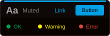<br>3024 Night | 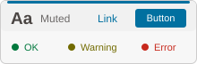<br>3024 Day |
| `ayu` | 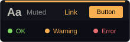<br>Ayu | 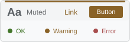<br>Ayu Light |
| `catppuccin` | 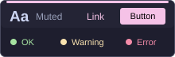<br>Catppuccin Mocha | 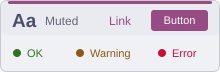<br>Catppuccin Latte |
| `dracula` | 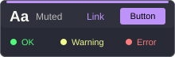<br>Dracula | 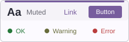<br>Adapted light palette |
| `everforest` | 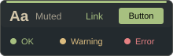<br>Everforest Dark Med | 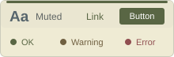<br>Everforest Light Med |
| `github` | 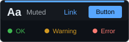<br>GitHub Dark Default | <br>GitHub Light Default |
| `gruvbox` | 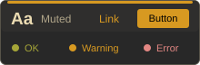<br>Gruvbox Dark | 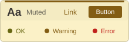<br>Gruvbox Light |
| `iceberg` | 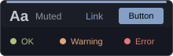<br>Iceberg Dark | 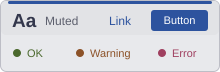<br>Iceberg Light |
| `kanagawa` | 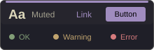<br>Kanagawa Wave | 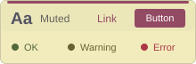<br>Kanagawa Lotus |
| `monokai` | 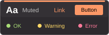<br>Monokai Pro | 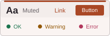<br>Monokai Pro Light |
| `night-owl` | 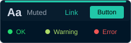<br>Night Owl | 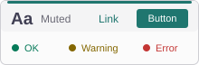<br>Light Owl |
| `nord` | 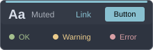<br>Nord | 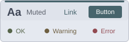<br>Nord Light |
| `oceanic-next` | 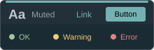<br>Oceanic Next | <br>Adapted light palette |
| `one` | 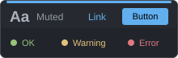<br>Atom One Dark | 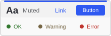<br>Atom One Light |
| `rose-pine` | 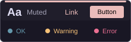<br>Rose Pine | 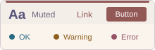<br>Rose Pine Dawn |
| `snazzy` | 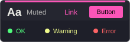<br>Snazzy | <br>Adapted light palette |
| `solarized` | 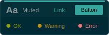<br>iTerm2 Solarized Dark | 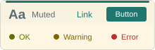<br>iTerm2 Solarized Light |
| `synthwave` | 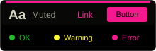<br>Synthwave | 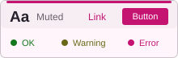<br>Adapted light palette |
| `tokyo-night` | 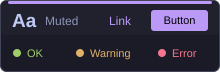<br>TokyoNight Night | 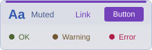<br>TokyoNight Day |
| `tomorrow` | 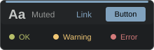<br>Tomorrow Night | <br>Tomorrow |

The previews come from `src/color-themes.css`. After you change a palette,
run `npm run docs:themes` from `webui/` to update the images.

These themes come from [iTerm2 Color Schemes](https://iterm2colorschemes.com/).
The site has no popularity ranking. This selection includes familiar theme
families and a range of colors. UI surfaces use derived colors. Text colors
have adjustments for contrast. The source revision is in `src/color-themes.css`.
The [source license](public/third-party/iTerm2-Color-Schemes-LICENSE.txt)
is included in the UI build.

Unset, blank, `default`, and unknown values use the original Hoglake palette.
The UI also uses that palette if `/v1/info` fails or the server predates this field.

## Metrics page

The Metrics page polls `GET /metrics` on an interval (15 s by default;
5, 30 and 60 s are offered, and the choice is remembered in the
browser) and keeps a bounded history per series in memory, for as long
as the tab is open. Each family draws its history above its snapshot:
gauges as values, counters as per-second rates, histograms as p50 and
p99 of each interval's observations, summaries as their quantiles. A
family with many label sets draws its 12 largest and says how many it
left out. The snapshot's per-series detail (bars, bucket strips,
quantiles) sits closed under a "show N series" button, since on a
large instance a family can carry hundreds of label sets. The window
is 960 polls (4 h at 15 s). Nothing is stored server-side, and a
reload starts the history over.

The star on a family pins it: pinned families sit at the top in pin
order, whatever the filter says, and the pins are remembered in the
browser. Charts are drawn with [uPlot](https://github.com/leeoniya/uPlot);
`src/lib/metricsHistory.ts` holds the ring buffers and the rate and
quantile math, and `test/metricsHistory.test.ts` covers them.

## Test / build

```sh
npm test               # vitest + testing-library, fetch mocked by hand
npm run build          # tsc -b && vite build → dist/
```

## Layout

`src/api/` holds the single integration surface: `types.ts` hand-mirrors
the OpenAPI schemas (snake_case passed through untouched; int64 fields
typed as strings — see `int64.ts`) and `client.ts` is the one typed
fetch client, which parses from raw response text through the int64
reviver and unwraps the `ApiError {error, detail}` body into a typed
exception every page renders inline. `src/pages/` has one component per
route (catalogs → catalog → namespace → table, plus per-catalog
consumers and partitions/compaction-debt, and the top-level metrics
page), `src/components/` the shared chrome (topbar with `/healthz`
polling + readiness tooltip and the instance-name badge, breadcrumbs,
badges, skeleton loaders, error boxes), and `src/lib/format.ts` the
humanizers (bytes, counts, partition transforms). Tests in `test/`
render each page against hand-written fixtures shaped exactly like the
spec's schemas and cover both the happy path and an API-error path per
page.
